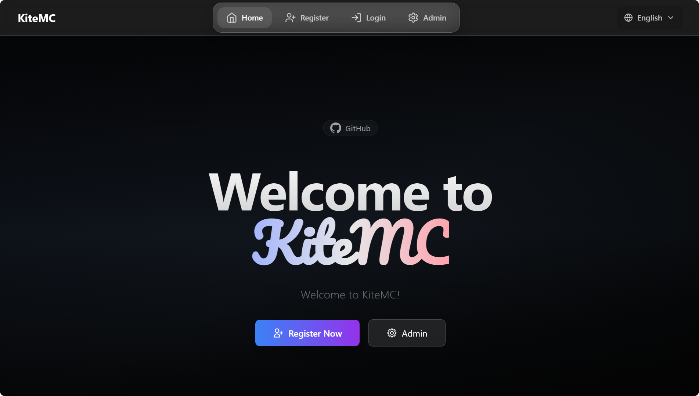
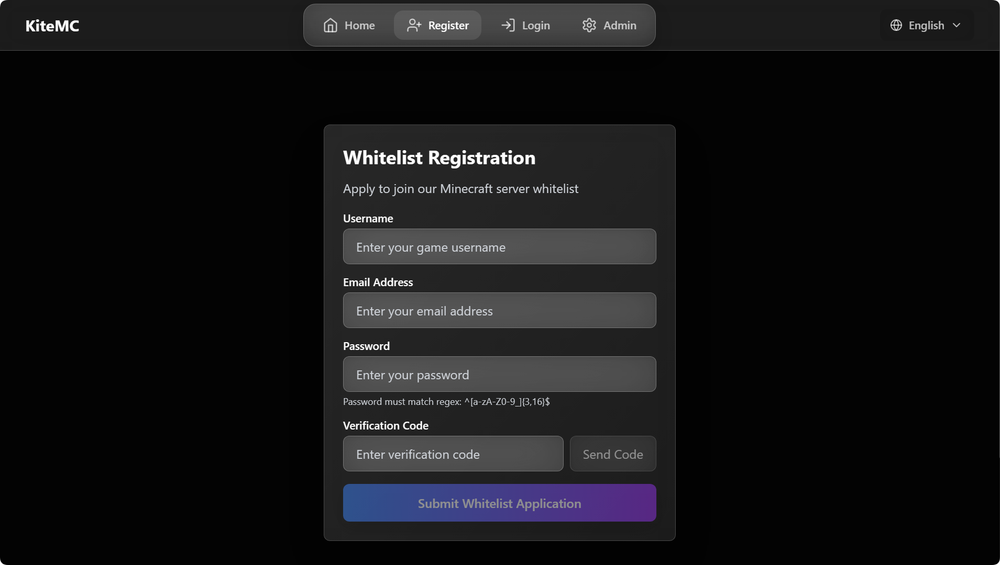
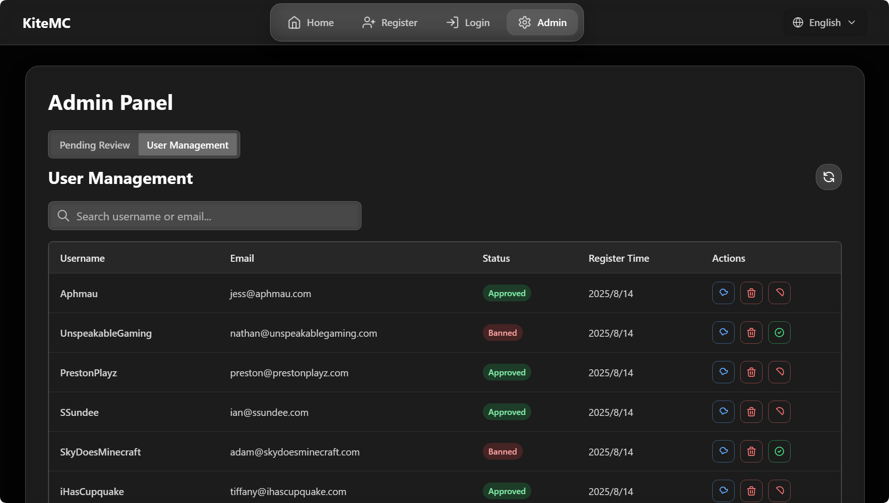

# 🛡️ VerifyMC

[简体中文](README_zh.md) | English | [📚 Official Documentation](https://kitemc.com/docs/VerifyMC/)

---

## 🚀 Introduction

**VerifyMC** is an ultra-lightweight, powerful whitelist management plugin for Minecraft servers. It supports web-based registration, auto/manual review, banning, theme switching, AuthMe integration, and high customizability, helping you secure and manage your server community with ease.

---

## 📝 Key Features

1. 🖥️ **Web Registration & Review**: Players can submit whitelist applications via a web page; admins can review, ban, and manage users online.
2. 🔒 **Auto/Manual Review**: Supports both automatic approval and manual admin review to fit different server needs.
3. 🚫 **Ban System**: Ban problematic players to keep your server safe.
4. 🎨 **Multi-theme & Custom Frontend**: Built-in `default`/`glassx` themes, easy theme switching, and support for custom uploads (npm build to static).
5. 📨 **Email Verification & Domain Whitelist**: Integrated SMTP email verification, supports email domain whitelist (mainstream domains by default, customizable and switchable) and alias limit.
6. 🌐 **Multi-language Support**: Both web UI and plugin messages support English and Chinese.
7. ⚙️ **Highly Customizable**: Set max accounts per email, player ID regex, whitelist bypass IPs, and more.
8. 🪶 **Lightweight**: Plugin jar is under 6MB, integrates multiple features, and runs efficiently.
9. 🔄 **Auto Update & Backup**: Config files auto-upgrade, with full backup before each update.
10. 🧩 **Flexible Whitelist Modes**: Supports Bukkit native whitelist sync, plugin self-management, and now external MySQL storage with auto-migration.
11. 💾 **MySQL & Data File Storage**: Easily switch between local file and MySQL storage; supports automatic migration and sync.
12. 📝 **Audit Log Multi-Storage**: Audit logs can be stored in file or MySQL.
13. 🌍 **Custom Internationalization**: Auto-loads any messages_xx.properties file; users can add any language.
14. 🔐 **AuthMe Integration**: Seamless integration with AuthMe plugin for password management, auto-registration, and user authentication.

---

## 🖼️ Screenshots (Glassx Theme)

### Home Page


### Registration Page


### Admin Panel


> Want to see Default theme? [Click here for Default theme screenshots.](./README_default.md)

---

## 🛠️ Tech Stack

- Java (Bukkit/Spigot/Paper plugin)
- Frontend: Vue3 + Tailwind CSS (custom themes supported)
- WebSocket real-time communication
- Email service: SMTP

---

## 📦 Installation & Configuration

1. Download the latest `VerifyMC.jar` and place it in your server's `plugins` directory.
2. Start the server to auto-generate config files, then edit `config.yml` as needed (see full example below).
3. Restart the server and visit `http://your_server_ip:8080` to access the admin panel.

```yaml
# ----------------------------------------
# General Settings
# ----------------------------------------
# Global language setting. Affects plugin messages and web UI. (e.g., 'zh', 'en')
language: zh
# Enable detailed console logs for troubleshooting.
debug: false

# ----------------------------------------
# Web Server
# ----------------------------------------
# The port for the web interface.
web_port: 8080
# The server name displayed on the web interface.
web_server_prefix: '[ Name ]'

# ----------------------------------------
# Verification & Whitelist
# ----------------------------------------
# Supported authentication methods. Currently, only 'email' is available.
auth_methods:
  - email
# Maximum number of game accounts that can be linked to a single email address.
max_accounts_per_email: 2
# Whitelist mode: 'bukkit' (syncs with server's whitelist.json) or 'plugin' (uses internal database).
whitelist_mode: bukkit
# Registration URL displayed to non-whitelisted players when in 'plugin' mode.
web_register_url: https://domain.com/

# ----------------------------------------
# Registration
# ----------------------------------------
# If true, new user registrations are automatically approved. If false, they require manual admin approval.
register:
  auto_approve: false

# ----------------------------------------
# User & Security
# ----------------------------------------
# A regular expression to validate player names.
username_regex: "^[a-zA-Z0-9_-]{3,16}$"
# If false, usernames that only differ by case (e.g., "Player" and "player") are treated as the same.
username_case_sensitive: false
# A list of IP addresses that can join the server without being whitelisted.
whitelist_bypass_ips:
  - 127.0.0.1
# The password for accessing the admin panel on the web interface.
admin:
  password: your_custom_password

# ----------------------------------------
# Frontend (UI)
# ----------------------------------------
frontend:
  # The visual theme for the web interface. Options: 'default', 'glassx'.
  theme: glassx
  # URL for the logo. Can be a web link or a local file path (e.g., '/logo.png').
  logo_url: /logo.png
  # A message to display on the homepage.
  announcement: Welcome to [ Name ]!

# ----------------------------------------
# Email (SMTP)
# ----------------------------------------
smtp:
  host: smtp.qq.com
  port: 587
  username: your_email@qq.com
  password: your_email_password
  from: your_email@qq.com
  enable_ssl: true

# ----------------------------------------
# Sync Settings (for bukkit mode)
# ----------------------------------------
# If true, automatically syncs changes from whitelist.json to the plugin's database.
whitelist_json_sync: true
# If true, automatically adds approved users to whitelist.json and removes banned/deleted users.
auto_sync_whitelist: true
# If 'bukkit' mode is disabled, this setting (if true) cleans players from whitelist.json.
auto_cleanup_whitelist: true

# ----------------------------------------
# Auto Update & Backup
# ----------------------------------------
# If true, automatically adds new settings to your config.yml on plugin updates.
auto_update_config: true
# If true, automatically updates the language files.
auto_update_i18n: true
# If true, automatically updates the email templates.
auto_update_email: true
# If true, automatically updates theme files.
auto_update_static: true
# If true, creates a full backup of the plugin data folder before any auto-updates.
backup_on_update: true 

# ----------------------------------------
# Email Registration Restrictions
# ----------------------------------------
# Enable email domain whitelist
enable_email_domain_whitelist: true
# Enable email alias limit (e.g. forbid user+xxx@gmail.com)
enable_email_alias_limit: false
# Email domain whitelist. Leave empty to use default mainstream domains
email_domain_whitelist:
  - gmail.com
  - 163.com
  - 126.com
  - qq.com
  - outlook.com
  - hotmail.com
  - icloud.com
  - yahoo.com
  - foxmail.com 

# ----------------------------------------
# Storage & Data Migration
# ----------------------------------------
storage:
  # Storage type, options: data (local file), mysql (external database)
  type: data
  # Whether to automatically migrate data from the original storage to the new storage when switching storage.type (e.g., data→mysql or mysql→data)
  auto_migrate_on_switch: false
  mysql:
    host: localhost
    port: 3306
    database: verifymc
    user: root
    password: yourpassword 

# ----------------------------------------
# Authme Integration Configuration
# ----------------------------------------
authme:
  # Whether to enable Authme integration functionality
  enabled: true
  # Whether to require password input during web registration
  require_password: true
  # Whether to automatically register to Authme when approval is granted
  auto_register: false
  # Whether to automatically unregister from Authme when user is deleted
  auto_unregister: false
  # Password regex pattern, default requires at least 6 characters
  password_regex: "^[a-zA-Z0-9_]{3,16}$" 
```
> ❤️ If you like this project, please Star, share, and give us feedback!