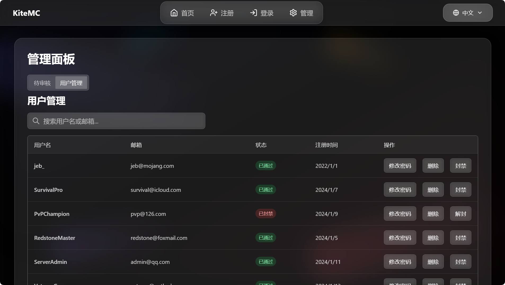
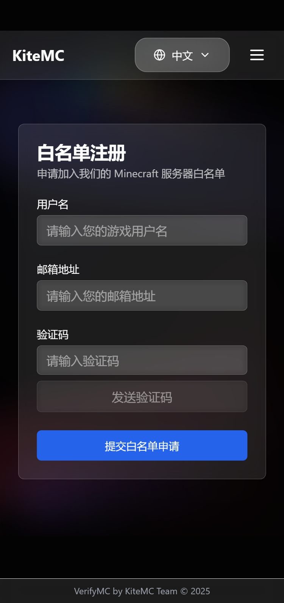

# 🛡️ VerifyMC

[English](README.md) | 简体中文 | [📚 官方文档](https://kitemc.com/docs/zh/VerifyMC/)

---

## 🖼️ 截图预览（Glassx 主题）

### 首页 / 注册页


### 管理后台


### 移动端 / 响应式


> 想看 Default 主题？[点此查看 Default 主题截图](./README_default_zh.md)

---

## 🚀 项目简介

**VerifyMC** 是一款极致轻量、功能强大的 Minecraft 服务器白名单管理插件，支持网页注册、自动/手动审核、封禁、主题切换与高度自定义，助力服务器安全与社区管理。

---

## 📝 主要功能

1. 🖥️ **网页注册与审核**：玩家可通过网页提交白名单申请，管理员可在线审核、封禁、管理玩家。
2. 🔒 **自动/手动审核**：支持自动通过或管理员手动审核，灵活适配不同服务器需求。
3. 🚫 **封禁系统**：支持对违规玩家进行封禁，保障服务器安全。
4. 🎨 **多主题与自定义前端**：内置 `default`/`glassx` 主题，支持自定义上传（npm build 后上传至 static）。
5. 📨 **邮件验证与域名白名单**：集成 SMTP 邮箱验证码，支持邮箱域名白名单（默认主流邮箱域，可自定义/开关）与邮箱别名限制。
6. 🌐 **多语言支持**：支持中英文界面与消息。
7. ⚙️ **高度定制化**：自定义单邮箱账号上限、玩家ID正则、免白名单IP等。
8. 🪶 **轻量级**：插件本体体积小于6MB，集成多种功能，运行高效，资源占用低，适合各类服务器环境。
9. 🔄 **自动更新与备份**：配置文件自动升级，升级前自动备份数据。
10. 🧩 **灵活白名单模式**：支持 Bukkit 原生白名单同步与插件自管理模式。

---

## 🛠️ 技术栈

- Java（Bukkit/Spigot/Paper 插件）
- 前端：Vue3 + Tailwind CSS（支持自定义主题）
- WebSocket 实时通信
- 邮件服务：SMTP

---

## 📦 安装与配置

1. 下载最新版 `VerifyMC.jar`，放入服务器 `plugins` 目录。
2. 启动服务器自动生成配置文件，按需编辑 `config.yml`（见下方完整示例）。
3. 重启服务器，访问 `http://你的服务器IP:8080` 进入管理后台。

```yaml
# ----------------------------------------
# 全局设置
# ----------------------------------------
# 全局语言设置，影响插件消息和网页界面。(例如 'zh', 'en')
language: zh
# 开启后，控制台会输出详细的日志，用于故障排查。
debug: false

# ----------------------------------------
# 网页服务器
# ----------------------------------------
# 网页服务使用的端口。
web_port: 8080
# 显示在网页界面上的服务器名称。
web_server_prefix: '[ Name ]'

# ----------------------------------------
# 验证与白名单
# ----------------------------------------
# 支持的验证方式。目前仅支持 'email'。
auth_methods:
  - email
# 单个邮箱最多可以绑定的游戏账号数量。
max_accounts_per_email: 2
# 白名单模式: 'bukkit' (与服务器的 whitelist.json 同步) 或 'plugin' (使用插件内部数据库)。
whitelist_mode: bukkit
# 在 'plugin' 模式下，向未在白名单中的玩家显示的注册URL。
web_register_url: https://domain.com/

# ----------------------------------------
# 注册
# ----------------------------------------
# 如果为 true，新用户注册将自动通过。如果为 false，则需要管理员手动审核。
register:
  auto_approve: false

# ----------------------------------------
# 用户与安全
# ----------------------------------------
# 用于验证玩家名的正则表达式。
username_regex: "^[a-zA-Z0-9_-]{3,16}$"
# 如果为 false，则仅大小写不同的用户名（例如 "Player" 和 "player"）将被视为相同。
username_case_sensitive: false
# 允许免白名单登录服务器的IP地址列表。
whitelist_bypass_ips:
  - 127.0.0.1
# 访问网页管理面板的密码。
admin:
  password: your_custom_password

# ----------------------------------------
# 前端 (UI)
# ----------------------------------------
frontend:
  # 网页界面的视觉主题。可选: 'default', 'glassx'。
  theme: glassx
  # Logo 的 URL。可以是网页链接或本地文件路径 (例如 '/logo.png')。
  logo_url: /logo.png
  # 显示在主页上的公告信息。
  announcement: 欢迎来到[ Name ]!

# ----------------------------------------
# 邮箱 (SMTP)
# ----------------------------------------
smtp:
  host: smtp.qq.com
  port: 587
  username: your_email@qq.com
  password: your_email_password
  from: your_email@qq.com
  enable_ssl: true

# ----------------------------------------
# 同步设置 (用于 bukkit 模式)
# ----------------------------------------
# 如果为 true，会自动将 whitelist.json 的变更同步到插件数据库。
whitelist_json_sync: true
# 如果为 true，会自动将已批准的玩家添加到 whitelist.json，并移除被封禁/删除的玩家。
auto_sync_whitelist: true
# 如果关闭了 'bukkit' 模式，此项若为 true，则会从 whitelist.json 清理本插件添加过的玩家。
auto_cleanup_whitelist: true

# ----------------------------------------
# 自动更新与备份
# ----------------------------------------
# 如果为 true，插件更新时会自动向 config.yml 中添加新增的配置项。
auto_update_config: true
# 如果为 true，将自动更新语言文件。
auto_update_i18n: true
# 如果为 true，将自动更新邮件模板。
auto_update_email: true
# 如果为 true，将自动更新主题文件。
auto_update_static: true
# 如果为 true，将在自动更新前完整备份插件数据文件夹。
backup_on_update: true

# ----------------------------------------
# 邮箱注册限制
# ----------------------------------------
# 邮箱域名白名单与别名限制
# 是否启用邮箱域名白名单（默认 true）
enable_email_domain_whitelist: true
# 是否限制邮箱别名（如禁止 user+xxx@gmail.com，默认 false）
enable_email_alias_limit: false
# 邮箱域名白名单，留空则使用主流邮箱域
email_domain_whitelist:
  - gmail.com
  - 163.com
  - 126.com
  - qq.com
  - outlook.com
  - hotmail.com
  - icloud.com
  - yahoo.com
  - foxmail.com
```
> ❤️ 如果你喜欢本项目，欢迎 Star、分享与反馈！ 